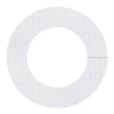

## 环形图
一个环形图（Doughnut）组件，基于 taro-vue 编写。

## 具体示例

## Props
|     参数      | 说明                              |  类型   |                    默认值                    |
| :-----------: | :-------------------------------- | :-----: | :------------------------------------------: |
|     value     | 绑定的值，可使用 v-model 双向绑定 |  Array  |                      []                      |
|    active     | 当前激活弧线的索引                | Number  |                      -1                      |
|     is2D      | 是否使用 `2d` 模式显示            | Boolean |                    false                     |
|    border     | 圆环边框宽度                      | Number  |                      32                      |
| activeBorder  | 激活状态圆环宽度                  | Number  |                      36                      |
|   duration    | 动画执行时长                      | Number  |                     600                      |
| borderBgColor | 弧线默认背景颜色                  | String  |                   #efefef                    |
| borderColors  | 默认每段弧线颜色                  |  Array  | ['#6d77e6', '#fe4e75', '#fcd95c', '#3bdeff'] |
|   tipsColor   | 环上提示文字颜色                  | String  |                   #ffffff                    |
|   tipsSize    | 环上提示文字大小                  | Number  |                      8                       |